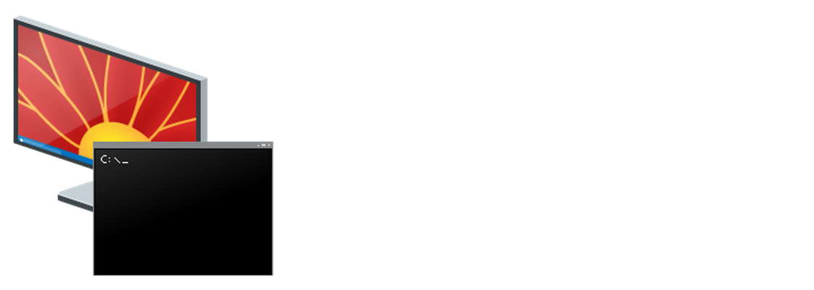
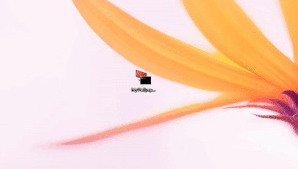
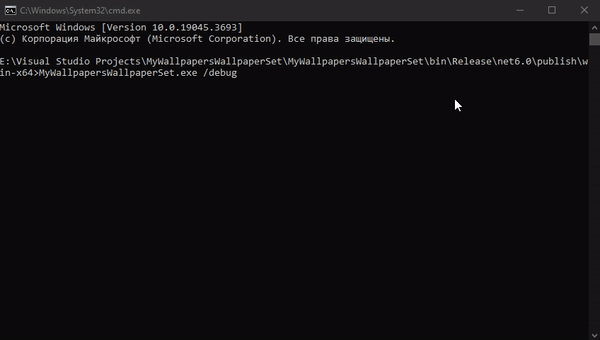
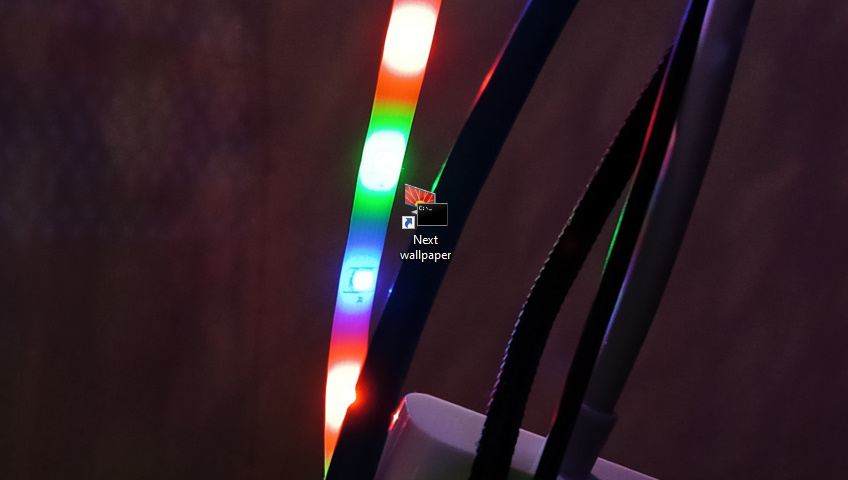
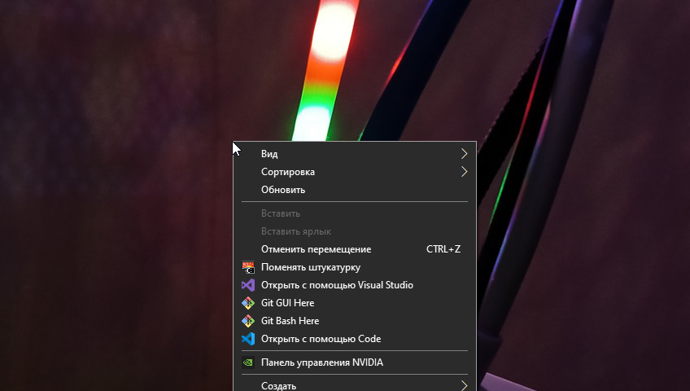
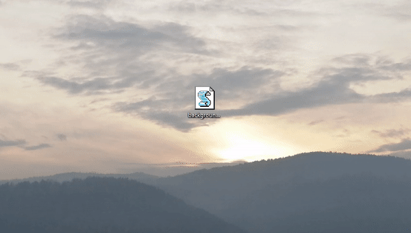
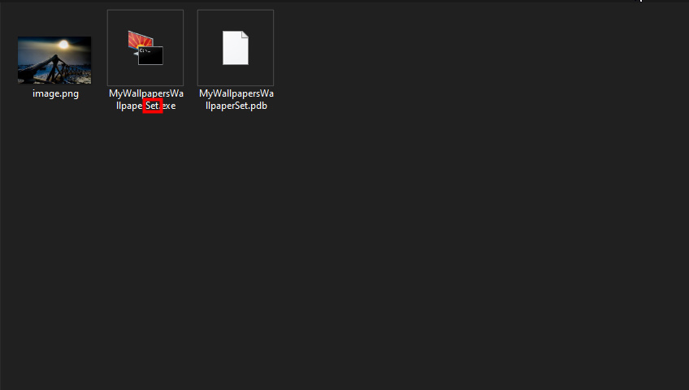

# Что такое My wallpapers wallpaper installer?
MWWI (My wallpapers wallpaper installer) - это программа, которая берёт рандомную картинку с сайта [My wallpapers](https://my-wallpapers.github.io) и ставит её на рабочий стол. Программа написана на C# с библиотекой `HTMLAgilityPack`. Для работы программы вам понадобится ОС `Windows 7+` и `.NET`. В репозитории находится `win-x64` и `win-x86` версия.



# Как работает программа?
Всё очень просто. Сначала MWWI загружает страницу My wallpapers, затем она делает "массив" с именами файлов и их расширениями, которые были записаны в аттрибуте `onclick`. После этого она выбирает рандомный объект и если этот объект - картинка, то она начинает загрузку изображения и ставит на рабочий стол, а если объект - `.html` файл, то он переходит на этот HTML файл и делает всё заново, но уже на этой странице.




(Над переводом во время разработки я особо не запаривался. В репозиториях лежат программы с исправленой грамматикой.)

# Как её использовать?
Тут есть 3 способа:

### 1-ый способ. Ярлык на рабочем столе.
Поместите программу куда угодно, а затем создайте ярлык на рабочий стол и переименуйте во что хотите.



### 2-ой способ. Автозагрузка.
Поместите программу любым способом в автозагрузку (лучше всего сделайте это через ярлык). Теперь при каждом входе в систему у вас будут рандомизированные обои.


### 3-ий способ. Контекстное меню Windows.

По [этому туториалу](https://www.youtube.com/watch?v=yLHNxrS_SRY) сделайте кнопку в контекстном меню. Теперь можно менять обои с контекстного меню (логично)



# Я не хочу видеть окно командной строки! ТЫ ОБЕЩАЛ ФОНОВЫЙ РЕ...
🤫

file.vbs
```vba
CreateObject("WScript.Shell").Run "cmd.exe /c путь\до\MWWI.exe", 0, false
```
Этот скрипт можно использовать во всех способах.



# Режим отладки
В MWWI есть режим отладки. Чтобы его включить, запустите программу с командой `/debug`.


# А что такое MWWS? (My wallpapers wallpaper set)
Это первое название этой программы. Как я и говорил, над переводом во время разработки я особо не запаривался.



#

конец.